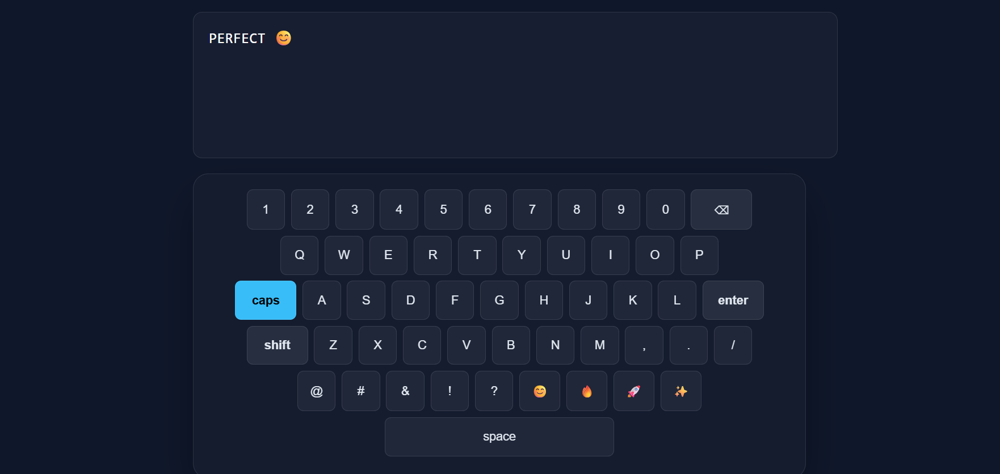

# Virtual Keyboard ⌨️

A modern and interactive virtual keyboard built using **HTML, CSS, and JavaScript**.  
The keyboard supports **uppercase/lowercase letters, numbers, special characters, emojis**, and functional keys like **Caps Lock, Shift, Backspace, Space, and Enter**.

## Features
- Caps Lock and Shift key support
- Uppercase and lowercase letter handling
- Numbers and special characters
- Emoji support
- Clean and professional UI
- Responsive keyboard layout

## Technologies Used
- HTML
- CSS
- JavaScript

## Preview

## How to Run
1. Clone the repository
2. Open `index.html` in your browser

## Future Improvements
- Dark/Light theme toggle
- Sound on key press
- Mobile optimization
- Physical keyboard synchronization

---

Built as a frontend practice project.
